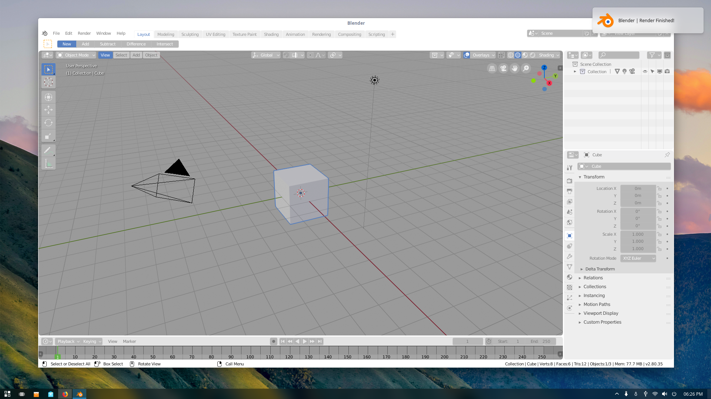

# Notify_Blender_Render
Currently working on Blender 2.7x and Blender 2.80.
Notify Sends a system notification when your render is complete, 
works on linux and theoretically on Windows too, 
havent tested it there yet.

How to install:

1.Clone or Download the github 
3.extract files anywhere 
4.open Blender 
5.go to file / user preferences 
6.click on the Add-on tab 
7.hit install from file 
8.Locate the send_notify2-8x.py or send_notify2-7x.py (depending on your blender version) file that was extracted from the .zip and double click it 
7. check the box next to system: notify on your add-ons tab 
8.save user settings.

Notify now supports notifications in 7 lenguages: English, Spanish, Catalan, Italian, French, German and Portuguese. 
Notify will auto detect the sytem lenguage.
